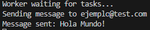
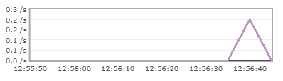

# RabbitMQ Test
## Laboratorio básico de API + Cola de mensajes

Este repositorio consiste de un laboratorio básico donde usando un contenedor de RabbitMQ vamos a guardar temporalmente y luego consumir una cola de mensajes entre un productor y un trabajador

## Requisitos
- Tener Python 3.10+ y alguna variedad de Docker Engine (Docker Desktop por ejemplo) instalados en el sistema

## Preparación del entorno
- Clonamos repositorio con 
```bash
git clone https://github.com/marlopia/rabbitmq_test
```

- Creamos un entorno virtual de python e instalamos las dependencias del mismo (instrucciones para Windows Powershell)
```bash
python -m venv venv
```
```bash
.\venv\Scripts\Activate.ps1
```
```bash
pip install -r requirements.txt
```

- Activamos el contenedor de RabbitMQ en Docker, si no tenemos los puertos libres usar otros cualesquiera. Si Docker no está en el PATH usar Docker Engine o la aplicación relevante. Le exponemos dos puertos: el 15672 es para la UI para que nosotros veamos los gráficos de carga. El 5672 es para que las aplicaciones se comuniquen con RabbitMQ.
```bash
docker run -d --name rabbitmq -p 5672:5672 -p 15672:15672 rabbitmq:3-management
```
Para comprobar que esté funcionando podemos navegar a http://localhost:15672/ y entrar con las credenciales por defecto; usuario: guest , contraseña: guest

- Abrimos una terminal en la raiz del proyecto y ejecutamos el servidor de FastAPI de fondo, podremos ver los logs de las peticiones HTTP en él
```bash
uvicorn producer:app --reload
```

## Pruebas

Dado a que el punto del laboratorio es ver como un trabajador consume de poco a poco una cola de mensajes, vamos a darle una terminal al trabajador:
```bash
python worker.py
```

En el archivo app.py tenemos un frontend minimalista en Flask que nos permitirá construir la petición POST con un formulario básico. Para lanzarla basta con introducir el siguiente comando desde la raíz del proyecto y navegar a la URL del puerto ingresado (por defecto 5000 por tanto http://localhost:5000/):
```bash
python app.py
```
Deberíamos ver algo tal que así:


Si probamos a enviar un mensaje de prueba, el trabajador debería de consumirlo y enseñarlo y veriamos lo siguiente en su terminal:



Y veriamos un pequeño pico en los gráficos de RabbitMQ:



Podemos hacer algo similar usando la API directamente, abriendo una herramienta de HTTP como Postman podemos enviar un POST con el JSON ya estructurado y recibiremos respuesta:


Por último, podemos hacer una prueba de estrés de un minuto usando la librería Faker para generar peticiones falsas. Para ello lanzamos el generador con este comando:
```bash
python faker_client.py
```
Y podemos ver como en RabbitMQ los gráficos se agrandan y como al trabajador le cuesta consumir los mensajes más de la velocidad de las que llegan, pero al estar en cola de RabbitMQ no los ignora y va poco a poco.


